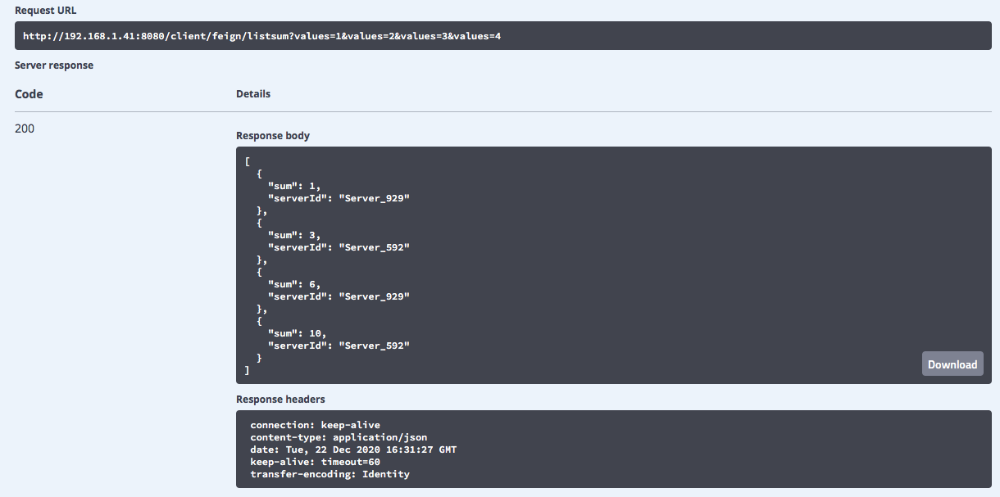
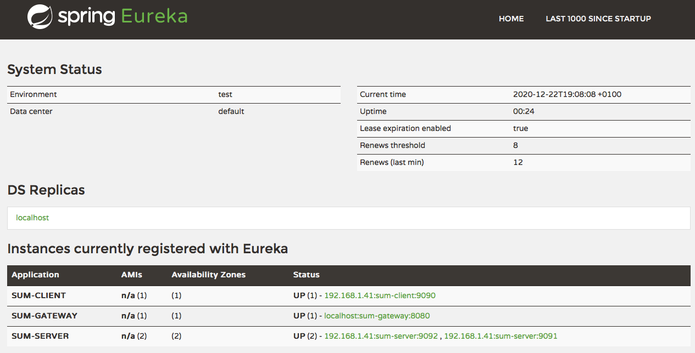
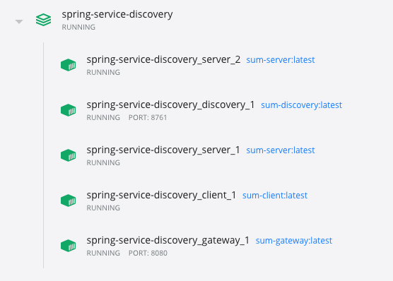
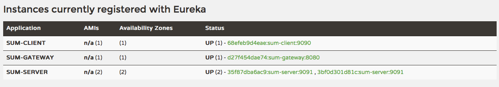

# Zuul + Eureka + RestTemplate/OpenFeign

- Build di entrambi i progetti (discovery, gateway, client, server): `./build-all.sh`
- Esecuzione di tutti i microservizi con docker: `docker-compose up`
- Service Discovery (Eureka): http://localhost:8761
- API Gateway (Zuul): http://localhost:8080
	- APIs: http://localhost:8080/swagger-ui.html

## Load balancing delle richieste sui 2 server


## Esecuzione senza Docker Compose

### Discovery
``` bash
$ cd discovery
$ mvn spring-boot:run
```

### Gateway
``` bash
$ cd gateway
$ mvn spring-boot:run
```

### Client
``` bash
$ cd client
$ mvn spring-boot:run
```

### Server\_1
``` bash
$ cd server
$ export SERVER_PORT=9091 && mvn spring-boot:run
```

### Server\_2
``` bash
$ cd server
$ export SERVER_PORT=9092 && mvn spring-boot:run
```


## Esecuzione con Docker Compose (modalità swarm)
**Nota**: Nel docker compose è possibile definire un numero di *repliche* per un servizio, ma tutti i servizi verranno comunque eseguito su di un singolo nodo (il proprio host).

Per attivare il deploy delle repliche su più nodi bisogna usare inizializzare uno swarm (con più nodi) e poi ueseguire: `docker stack deploy`.

### Eseguire tutti i servizi

**Nota**: le due istanze del servizio `server` sono entrambe in ascolto sulla porta `9091` ma su due container separati.

``` bash
$ docker-compose up
```

